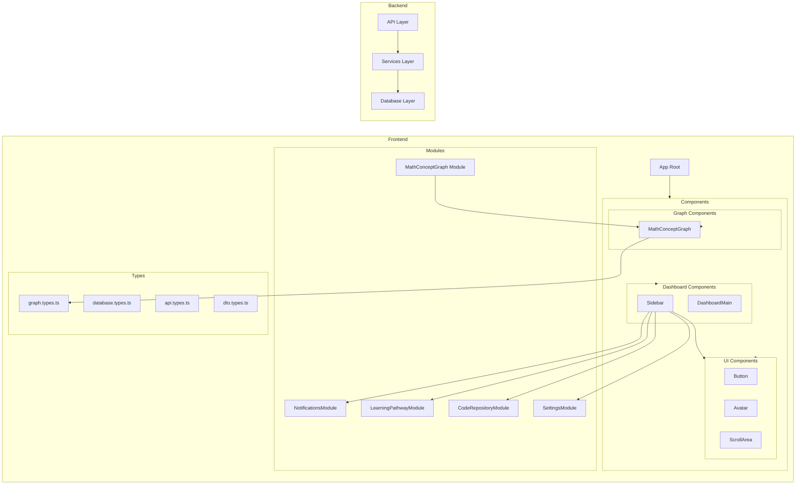

Alt_Codebase_Structure.md

```mermaid
graph LR
subgraph Frontend
App[App Root]
subgraph Components
subgraph UI["UI Components"]
Button["Button"]
Avatar["Avatar"]
ScrollArea["ScrollArea"]
end
subgraph Dashboard["Dashboard Components"]
Sidebar["Sidebar"]
DashboardMain["DashboardMain"]
end
subgraph Graphs["Graph Components"]
MathConceptGraph["MathConceptGraph"]
end
end
subgraph Modules["Modules"]
MCG["MathConceptGraph Module"]
NM["NotificationsModule"]
LPM["LearningPathwayModule"]
CRM["CodeRepositoryModule"]
SM["SettingsModule"]
end
subgraph Types["Types"]
GraphTypes["graph.types.ts"]
DatabaseTypes["database.types.ts"]
APITypes["api.types.ts"]
DTOTypes["dto.types.ts"]
end
end
subgraph Backend
API["API Layer"]
Services["Services Layer"]
Database["Database Layer"]
end
%% Connections
App --> Components
Components --> UI
Components --> Dashboard
Components --> Graphs
Sidebar --> UI
MathConceptGraph --> GraphTypes
MCG --> MathConceptGraph
API --> Services
Services --> Database
%% Module connections
Sidebar --> NM
Sidebar --> LPM
Sidebar --> CRM
Sidebar --> SM
```