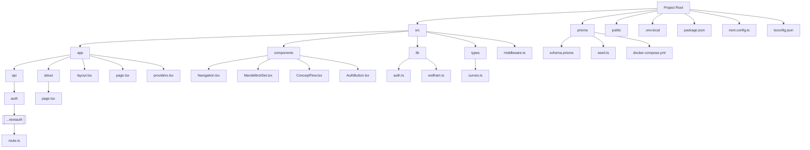
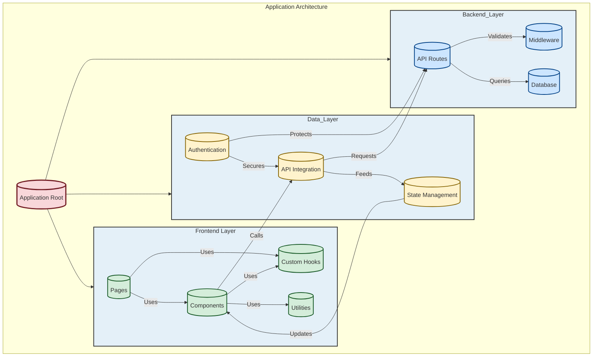

Codebase_Structure.md

# Codebase Structure

## Project Structure
The codebase follows a standard Next.js project structure with additional organization for maintainability and scalability.

## Key Directories
- `/src`: Main source code
  - `/app`: Next.js app router pages and API routes
  - `/components`: Reusable React components
  - `/lib`: Utility functions and configurations
  - `/types`: TypeScript type definitions
- `/prisma`: Database schema and migrations
- `/public`: Static assets

## Architecture Overview
The application follows a layered architecture pattern as shown in the diagrams below. Key aspects include:

- Clear separation between frontend, data layer, and backend
- Component-based UI architecture
- Type-safe data flow
- API-driven data fetching
- Secure authentication flow

