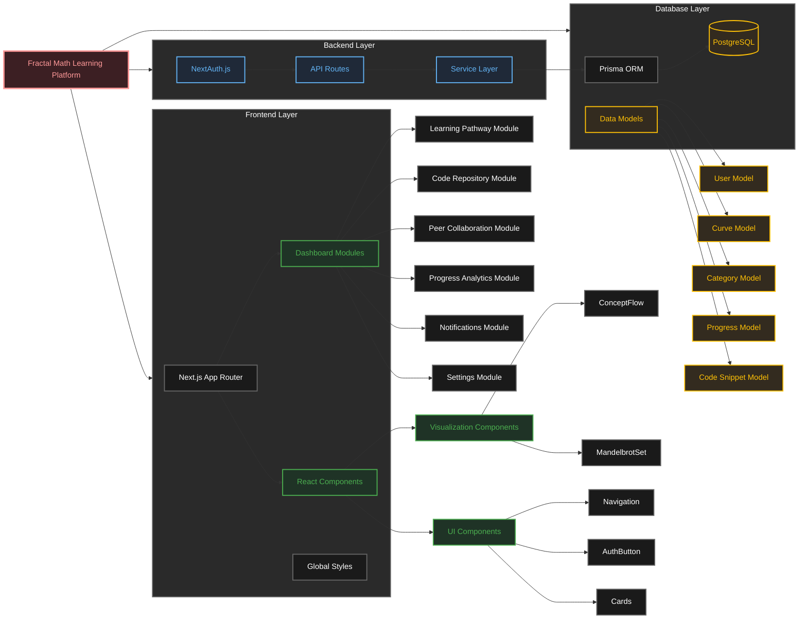

# Systems Diagram

```mermaid
graph LR
    %% Style Definitions
    classDef default fill:#1a1a1a,stroke:#666,stroke-width:2px,color:#fff;
    classDef layer fill:#2a2a2a,stroke:#666,stroke-width:2px,color:#fff;
    classDef root fill:#3c1f23,stroke:#ff9999,stroke-width:3px,color:#ff9999;
    classDef component fill:#1f3326,stroke:#4caf50,stroke-width:2px,color:#4caf50;
    classDef data fill:#332b1f,stroke:#ffc107,stroke-width:2px,color:#ffc107;
    classDef backend fill:#1f2938,stroke:#64b5f6,stroke-width:2px,color:#64b5f6;

    %% Root and Main Layers
    Root[Fractal Math Learning Platform] --> Frontend
    Root --> Backend
    Root --> Database

    %% Frontend Layer
    subgraph Frontend[Frontend Layer]
        NextApp[Next.js App Router]
        Components[React Components]
        Modules[Dashboard Modules]
        Styles[Global Styles]
    end

    %% Components Breakdown
    Components --> UI[UI Components]
    Components --> Visualization[Visualization Components]
    
    Visualization --> ConceptFlow[ConceptFlow]
    Visualization --> MandelbrotSet[MandelbrotSet]
    
    UI --> Navigation[Navigation]
    UI --> AuthButton[AuthButton]
    UI --> Cards[Cards]

    %% Modules Breakdown
    Modules --> LPM[Learning Pathway Module]
    Modules --> CRM[Code Repository Module]
    Modules --> PCM[Peer Collaboration Module]
    Modules --> PAM[Progress Analytics Module]
    Modules --> NM[Notifications Module]
    Modules --> SM[Settings Module]

    %% Backend Layer
    subgraph Backend[Backend Layer]
        Auth[NextAuth.js]
        APIs[API Routes]
        Services[Service Layer]
    end

    %% Database Layer
    subgraph Database[Database Layer]
        PostgreSQL[(PostgreSQL)]
        Prisma[Prisma ORM]
        Models[Data Models]
    end

    %% Data Models
    Models --> Users[User Model]
    Models --> Curves[Curve Model]
    Models --> Categories[Category Model]
    Models --> Progress[Progress Model]
    Models --> CodeSnippets[Code Snippet Model]

    %% Connections
    NextApp --> Components
    NextApp --> Modules
    APIs --> Services
    Services --> Prisma
    Prisma --> PostgreSQL
    Auth --> APIs
    
    %% Apply Classes
    class Root root;
    class Frontend,Backend,Database layer;
    class Components,Modules,UI,Visualization component;
    class PostgreSQL,Models,Users,Curves,Categories,Progress,CodeSnippets data;
    class Auth,APIs,Services backend;
```

