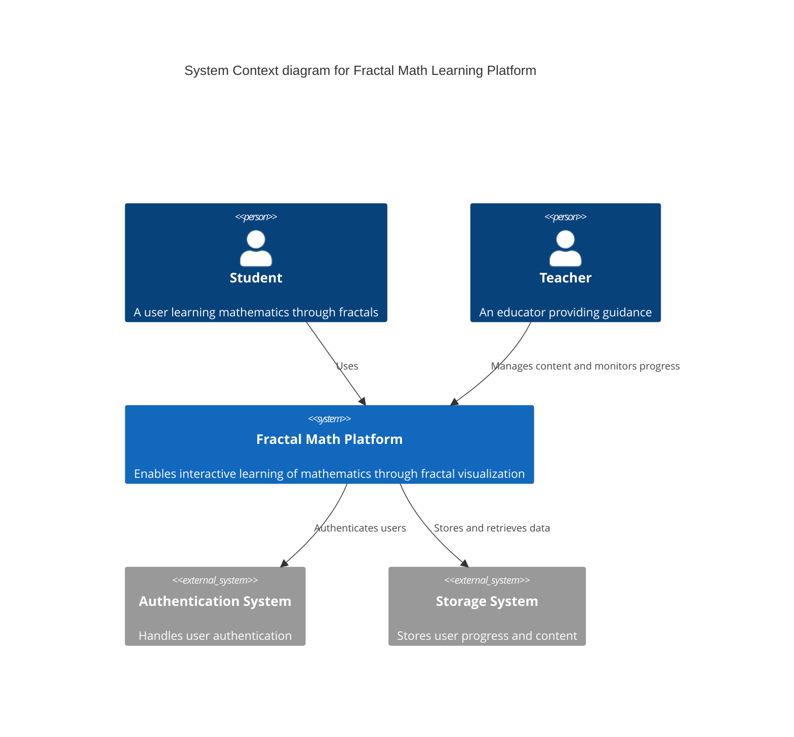
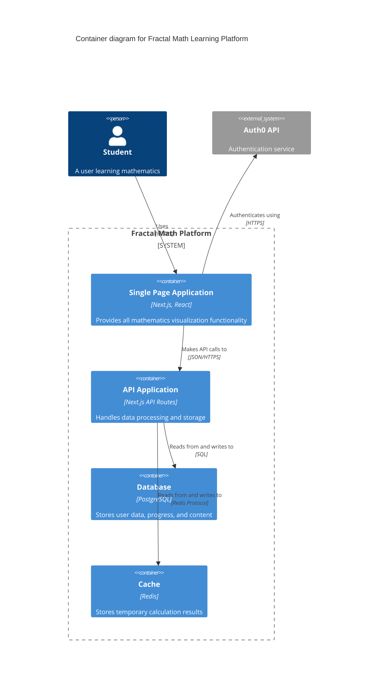
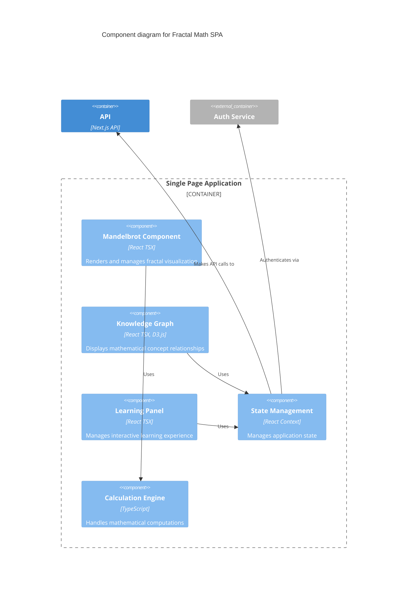
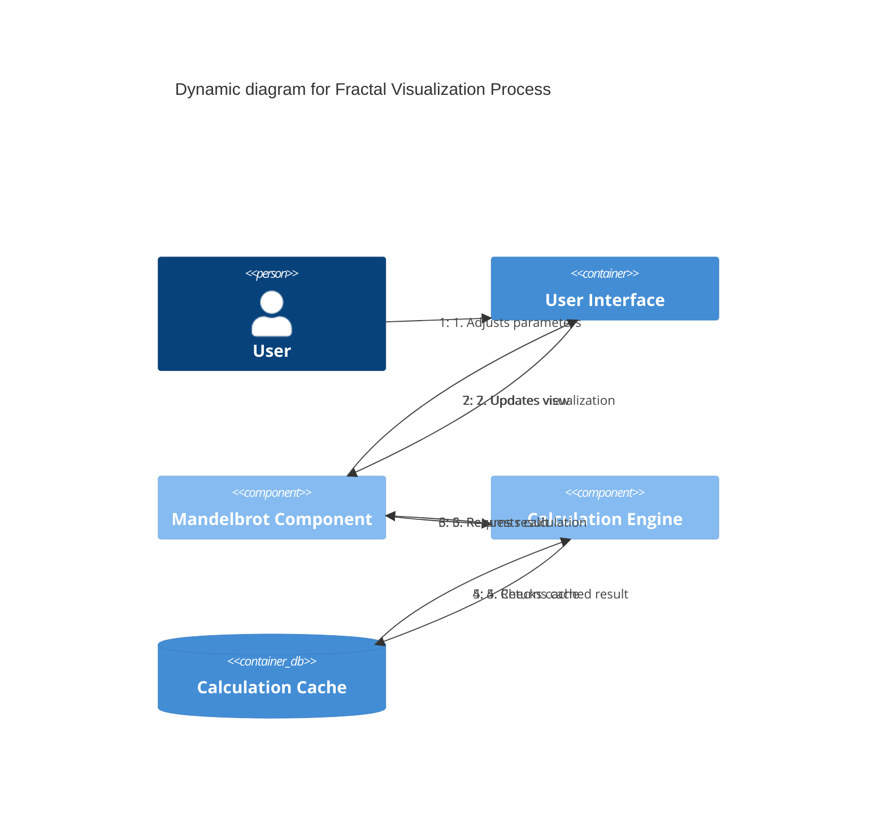

# C4 Model Diagrams

## System Context (Level 1)

```mermaid
C4Context
    title System Context diagram for Fractal Math Learning Platform

    Person(student, "Student", "A user learning mathematics through fractals")
    Person(teacher, "Teacher", "An educator providing guidance")

    System(fractalMath, "Fractal Math Platform", "Enables interactive learning of mathematics through fractal visualization")

    System_Ext(authSystem, "Authentication System", "Handles user authentication")
    System_Ext(storageSystem, "Storage System", "Stores user progress and content")

    Rel(student, fractalMath, "Uses")
    Rel(teacher, fractalMath, "Manages content and monitors progress")
    Rel(fractalMath, authSystem, "Authenticates users")
    Rel(fractalMath, storageSystem, "Stores and retrieves data")
```

## Container (Level 2)

```mermaid
C4Container
    title Container diagram for Fractal Math Learning Platform

    Person(student, "Student", "A user learning mathematics")

    System_Boundary(c1, "Fractal Math Platform") {
        Container(spa, "Single Page Application", "Next.js, React", "Provides all mathematics visualization functionality")
        Container(api, "API Application", "Next.js API Routes", "Handles data processing and storage")
        Container(db, "Database", "PostgreSQL", "Stores user data, progress, and content")
        Container(cache, "Cache", "Redis", "Stores temporary calculation results")
    }

    System_Ext(auth0, "Auth0 API", "Authentication service")

    Rel(student, spa, "Uses", "HTTPS")
    Rel(spa, api, "Makes API calls to", "JSON/HTTPS")
    Rel(api, db, "Reads from and writes to", "SQL")
    Rel(api, cache, "Reads from and writes to", "Redis Protocol")
    Rel(spa, auth0, "Authenticates using", "HTTPS")
```

## Component (Level 3)

```mermaid
C4Component
    title Component diagram for Fractal Math SPA

    Container_Boundary(spa, "Single Page Application") {
        Component(mandelbrot, "Mandelbrot Component", "React TSX", "Renders and manages fractal visualization")
        Component(knowledge, "Knowledge Graph", "React TSX, D3.js", "Displays mathematical concept relationships")
        Component(learning, "Learning Panel", "React TSX", "Manages interactive learning experience")
        Component(state, "State Management", "React Context", "Manages application state")
        Component(calc, "Calculation Engine", "TypeScript", "Handles mathematical computations")
    }

    Container(api, "API", "Next.js API")
    Container_Ext(auth, "Auth Service")

    Rel(mandelbrot, calc, "Uses")
    Rel(knowledge, state, "Uses")
    Rel(learning, state, "Uses")
    Rel(state, api, "Makes API calls to")
    Rel(state, auth, "Authenticates via")
```

## Code (Level 4)

```mermaid
C4Dynamic
    title Dynamic diagram for Fractal Visualization Process

    Person(user, "User")
    Container(ui, "User Interface")
    Component(mandelbrot, "Mandelbrot Component")
    Component(calc, "Calculation Engine")
    ContainerDb(cache, "Calculation Cache")

    Rel(user, ui, "1. Adjusts parameters")
    Rel(ui, mandelbrot, "2. Updates view")
    Rel(mandelbrot, calc, "3. Requests calculation")
    Rel(calc, cache, "4. Checks cache")
    Rel(cache, calc, "5. Returns cached result")
    Rel(calc, mandelbrot, "6. Returns result")
    Rel(mandelbrot, ui, "7. Updates visualization")
```
