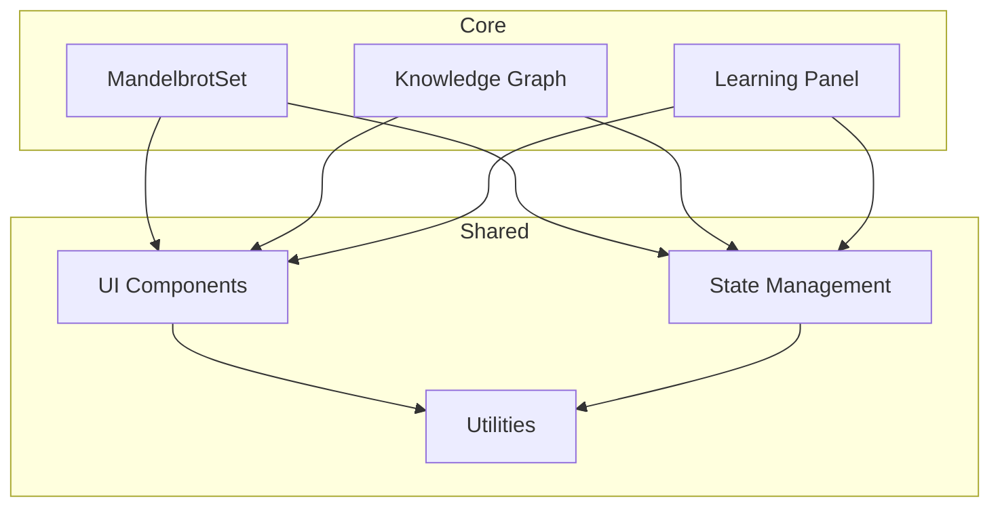
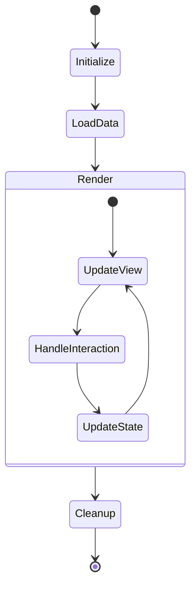

# Component Usage Documentation

## Core Components

### MandelbrotSet Component
**Location**: `src/components/MandelbrotSet.tsx`
**Usage Locations**:
- Main visualization page
- Learning modules for fractal exploration
- Shared visualization in peer learning sessions

**Key Features**:
- Real-time fractal rendering
- Parameter adjustment interface
- Zoom and pan controls
- Configuration saving

### Knowledge Graph Components

#### ConceptFlow
**Location**: `src/modules/knowledgeGraph/ConceptFlow.tsx`
**Usage Locations**:
- Concept exploration interface
- Learning path visualization
- Progress tracking view

**Key Features**:
- Interactive concept navigation
- Relationship visualization
- Progress indicators
- Custom path creation

#### ConceptExplorer
**Location**: `src/modules/knowledgeGraph/ConceptExplorer.tsx`
**Usage Locations**:
- Detailed concept view
- Learning module navigation
- Related concepts exploration

**Key Features**:
- Concept details display
- Interactive learning materials
- Progress tracking
- Related concept links

### Learning Panel Components

#### PeerLearningModule
**Location**: `src/modules/LearningPanel/PeerLearningModule.tsx`
**Usage Locations**:
- Collaborative learning sessions
- Group study interfaces
- Shared workspaces

**Key Features**:
- Real-time collaboration
- Shared visualization
- Chat functionality
- Progress synchronization

## Shared Components

### UI Components
- Button components
- Modal dialogs
- Navigation elements
- Progress indicators
- Form elements

### State Management
- User context providers
- Learning progress tracking
- Configuration management
- Session handling

### Utility Components
- Error boundaries
- Loading states
- Authentication wrappers
- Analytics tracking

## Component Dependencies

## Component Lifecycle

