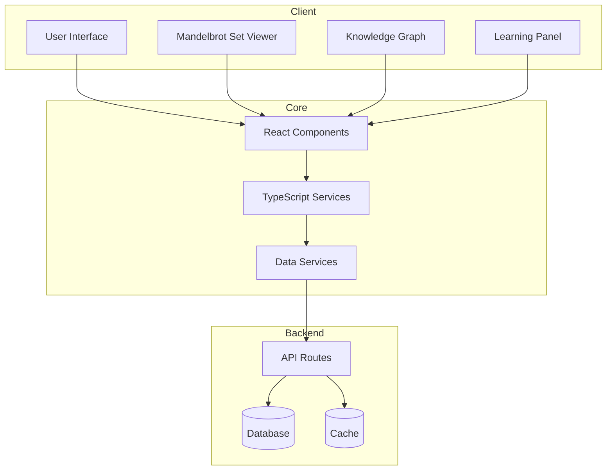
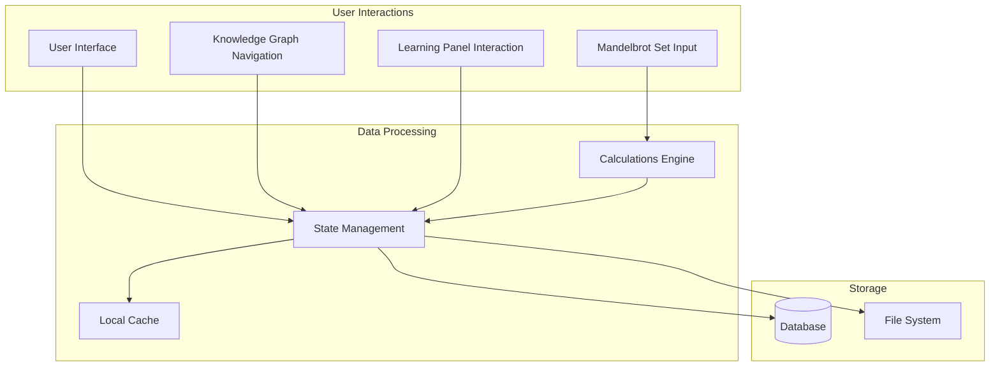
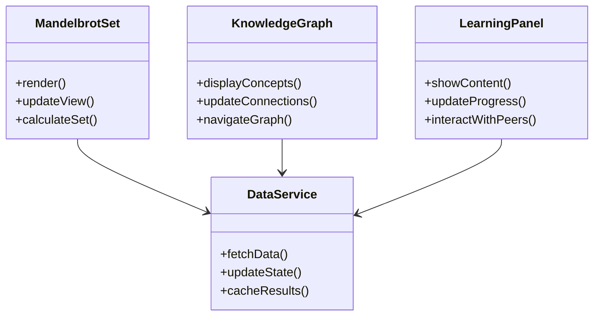

# System Architecture

## Current System Architecture

```mermaid
graph TB
    subgraph Client
        UI[User Interface]
        MS[Mandelbrot Set Viewer]
        KG[Knowledge Graph]
        LP[Learning Panel]
    end

    subgraph Core
        RC[React Components]
        TS[TypeScript Services]
        DS[Data Services]
    end

    subgraph Backend
        API[API Routes]
        DB[(Database)]
        Cache[(Cache)]
    end

    UI --> RC
    MS --> RC
    KG --> RC
    LP --> RC
    RC --> TS
    TS --> DS
    DS --> API
    API --> DB
    API --> Cache
```

## Data Flow Architecture

```mermaid
flowchart TB
    subgraph User Interactions
        UI[User Interface]
        MS[Mandelbrot Set Input]
        KG[Knowledge Graph Navigation]
        LP[Learning Panel Interaction]
    end

    subgraph Data Processing
        CALC[Calculations Engine]
        STORE[State Management]
        CACHE[Local Cache]
    end

    subgraph Storage
        DB[(Database)]
        FS[File System]
    end

    UI --> STORE
    MS --> CALC
    KG --> STORE
    LP --> STORE
    CALC --> STORE
    STORE --> CACHE
    STORE --> DB
    STORE --> FS
```

## Component Architecture

```mermaid
classDiagram
    class MandelbrotSet {
        +render()
        +updateView()
        +calculateSet()
    }

    class KnowledgeGraph {
        +displayConcepts()
        +updateConnections()
        +navigateGraph()
    }

    class LearningPanel {
        +showContent()
        +updateProgress()
        +interactWithPeers()
    }

    class DataService {
        +fetchData()
        +updateState()
        +cacheResults()
    }

    MandelbrotSet --> DataService
    KnowledgeGraph --> DataService
    LearningPanel --> DataService
```
