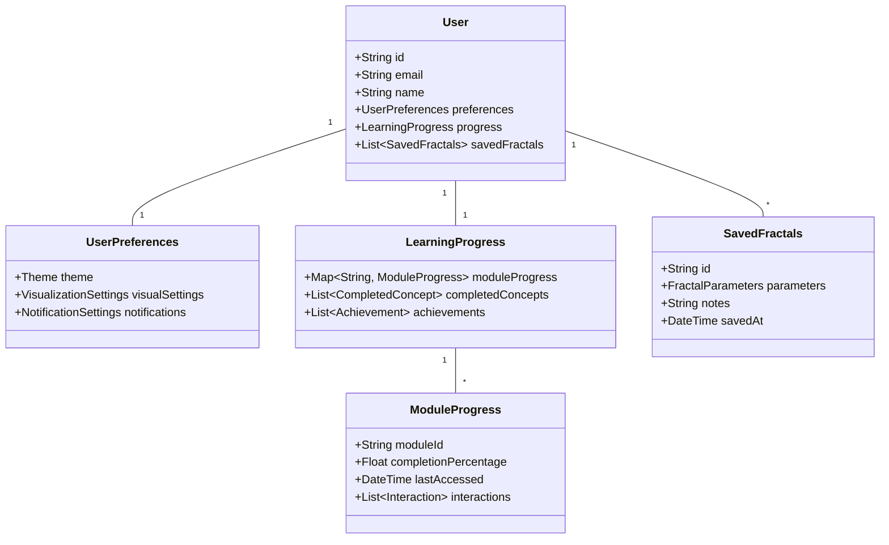
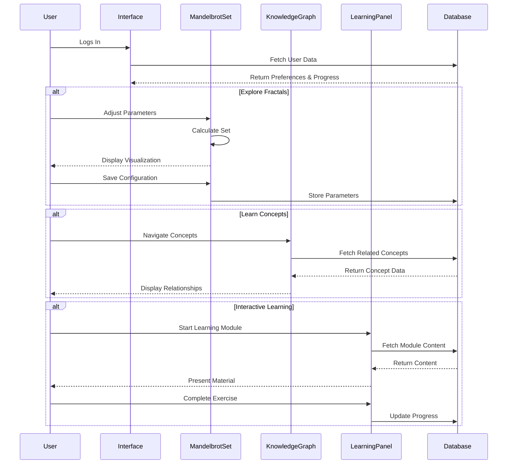
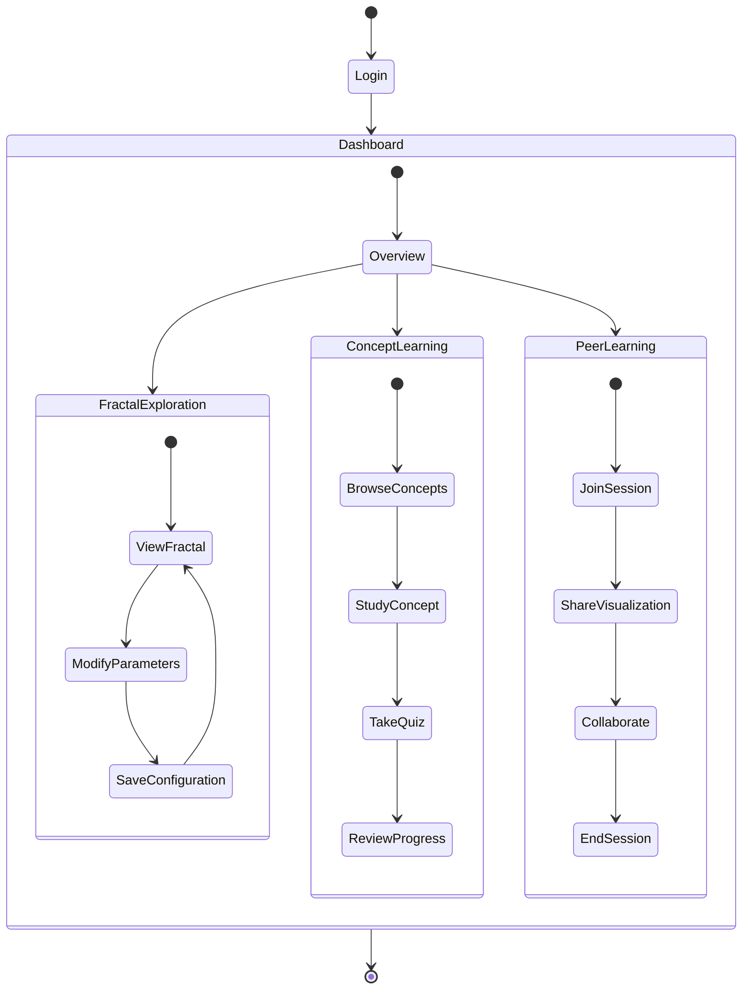

# User Data Model and Flow

## User Data Model

```mermaid
classDiagram
    class User {
        +String id
        +String email
        +String name
        +UserPreferences preferences
        +LearningProgress progress
        +List~SavedFractals~ savedFractals
    }

    class UserPreferences {
        +Theme theme
        +VisualizationSettings visualSettings
        +NotificationSettings notifications
    }

    class LearningProgress {
        +Map~String, ModuleProgress~ moduleProgress
        +List~CompletedConcept~ completedConcepts
        +List~Achievement~ achievements
    }

    class ModuleProgress {
        +String moduleId
        +Float completionPercentage
        +DateTime lastAccessed
        +List~Interaction~ interactions
    }

    class SavedFractals {
        +String id
        +FractalParameters parameters
        +String notes
        +DateTime savedAt
    }

    User "1" -- "1" UserPreferences
    User "1" -- "1" LearningProgress
    User "1" -- "*" SavedFractals
    LearningProgress "1" -- "*" ModuleProgress
```

## User Interaction Flow

```mermaid
sequenceDiagram
    participant U as User
    participant UI as Interface
    participant MS as MandelbrotSet
    participant KG as KnowledgeGraph
    participant LP as LearningPanel
    participant DB as Database

    U->>UI: Logs In
    UI->>DB: Fetch User Data
    DB-->>UI: Return Preferences & Progress
    
    alt Explore Fractals
        U->>MS: Adjust Parameters
        MS->>MS: Calculate Set
        MS-->>U: Display Visualization
        U->>MS: Save Configuration
        MS->>DB: Store Parameters
    end

    alt Learn Concepts
        U->>KG: Navigate Concepts
        KG->>DB: Fetch Related Concepts
        DB-->>KG: Return Concept Data
        KG-->>U: Display Relationships
    end

    alt Interactive Learning
        U->>LP: Start Learning Module
        LP->>DB: Fetch Module Content
        DB-->>LP: Return Content
        LP-->>U: Present Material
        U->>LP: Complete Exercise
        LP->>DB: Update Progress
    end
```

## Module Interaction Model

```mermaid
stateDiagram-v2
    [*] --> Login
    Login --> Dashboard

    state Dashboard {
        [*] --> Overview
        Overview --> FractalExploration
        Overview --> ConceptLearning
        Overview --> PeerLearning
    }

    state FractalExploration {
        [*] --> ViewFractal
        ViewFractal --> ModifyParameters
        ModifyParameters --> SaveConfiguration
        SaveConfiguration --> ViewFractal
    }

    state ConceptLearning {
        [*] --> BrowseConcepts
        BrowseConcepts --> StudyConcept
        StudyConcept --> TakeQuiz
        TakeQuiz --> ReviewProgress
    }

    state PeerLearning {
        [*] --> JoinSession
        JoinSession --> ShareVisualization
        ShareVisualization --> Collaborate
        Collaborate --> EndSession
    }

    Dashboard --> [*]
```
